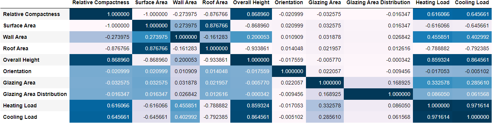
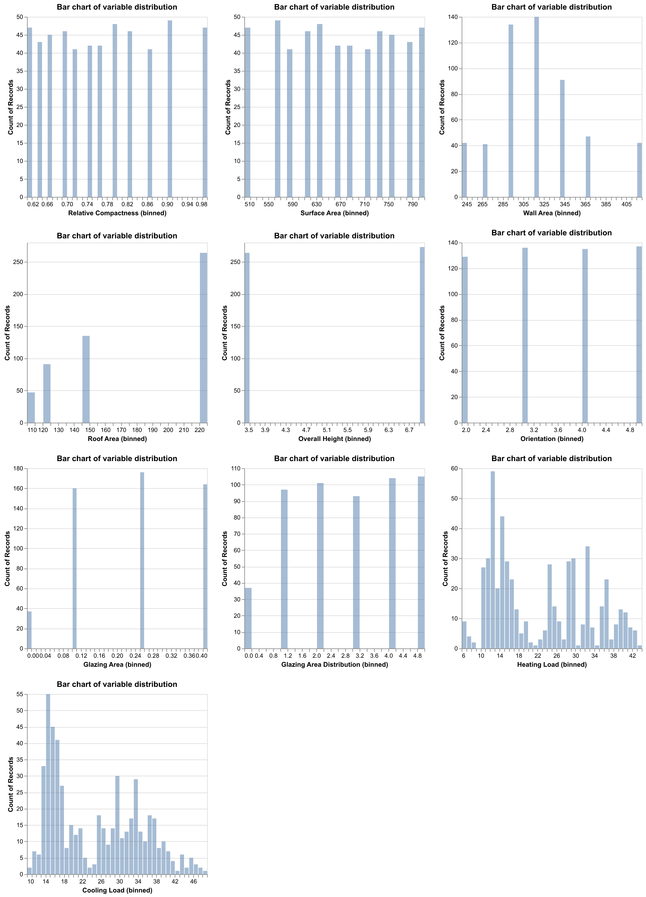
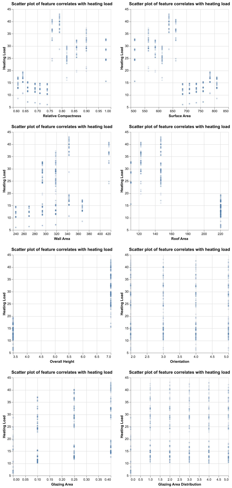
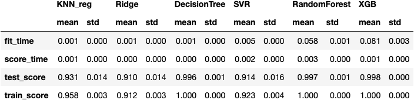
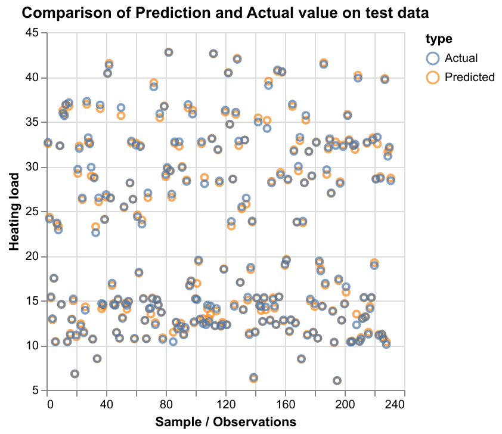

```{r setup, include=FALSE}
knitr::opts_chunk$set(echo = TRUE)
knitr::opts_knit$set(root.dir = here::here())
library(tidyverse)
library(knitr)
library(reticulate)

```

## Summary of the data set

The data set used in this project is retrieved from Tsanas and Xifara (2012). It was contributed by Angeliki Xifara (Civil/Structural Engineer) and was processed by Athanasios Tsanas (Oxford Centre for Industrial and Applied Mathematics, University of Oxford, UK). It contains 768 instances and was donated at 2012-11-30. It has no missing values. It has a total of 10 variables, with 8 of them are attributes(features) and two responses. The authors suggested that the aim of this data set is to use the eight features to predict the two responses. These variables are shown in the table below:

```{r variables in the data set table, echo=FALSE}
variable <- c('X1','X2','X3','X4','X5','X6','X7','X8','y1','y2')
description <- c('Relative Compactness',
                 'Surface Area',
                 'Wall Area',
                 'Roof Area',
                 'Overall Height',
                 'Orientation',
                 'Glazing Area',
                 'Glazing Area Distribution',
                 'Heating Load',
                 'Cooling Load')
table1 <- tibble(variable,
                 description)

knitr::kable( table1, 
              caption = "Table 1. Variables in the data set")
```

## Research question

**How important would each feature be in predicting the 'Heating Load' of the building? What contribution level of each feature to the 'Heating Load' of the building?**

## Download data

**NOTE: Data download can be conducted using 'download_data.py' in the energy_efficiency_analysis/src folder with the explanation below:**

'This code is to download original raw file data from UCI ML databses and convert it to csv file and finally save to provided destination folder
example :
python src/download_data.py --url=http://archive.ics.uci.edu/ml/machine-learning-databases/00242/ENB2012_data.xlsx  --out_file=data/raw/ENB2012_data.csv'

## Data pre-processing: partition the data set into training and test sub-data sets

The data set was divided into train and test sets, with 70% train data and 30% test data.

**NOTE: Data preprocessing can be conducted using 'data_preprocess.py' in the energy_efficiency_analysis/src folder with the explanation below:**

'This code is to csv data and performs data cleaning, pre-processingm, then
separating into train and test data sets, and finally save to provided destination folder.
example :
python src/data_preprocess.py data/processed/energy_effeciency_processed.csv data/processed/train_df.csv data/processed/test_df.csv'

```{r data partition table, echo=FALSE}
cases <- c(537, 231)
subdataset <- c('Trainset',
                 'Test set')
table2 <- tibble(cases,
                 subdataset)

knitr::kable(table2, 
              caption = "Table 2. Partition of the data set")
```

## Packages utilized in this project
Pandas[@reback2020pandas]

Numpy[@harris2020array]

Altair[@vanderplas2018altair]

SKlearn[@scikit-learn]

## Exploratory data analysis with the train set

The exploratory data analysis was conducted through the following steps:

1. Load the necessary packages and split the data into train and test sets. NaN data were dropped;

2. do EDA on the train set. First, to check the data types and see if there were missing values, we found out that there were no missing values. Then we see the data distribution through bar plots, value_counts, correlations, and pairwise scatter plots. Through the EDA, we could identify that all the variables are numeric.

3. From the above analysis, we proceeded to do a supervised machine learning model with data preprocessed by Standard Scaling on the numeric features with Heating Load as the target.

**NOTE: Data preprocessing can be conducted using 'data_preprocess.py' in the energy_efficiency_analysis/src folder**

Isles:


Isles:

Isles:


**NOTE: The EDA can be conducted using 'eda_script_plots_update.py' in the energy_efficiency_analysis/src folder:**

'This code is to read the train data set and performs explanatory data analysis and finally save to provided destination folder
example :
python src/eda_script_plots_update.py data/processed/train_df.csv results/eda/eda_corr_table.png results/eda/eda_distribution_plot.png results/eda/eda_scatter1_plot.png results/eda/eda_scatter2_plot.png'

## Modelling and Analysis

In this analysis, the heat load is predicted using the features Relative Compactness, Surface Area, Wall Area, Roof Area, Overall Height, Orientation,Glazing Area, Glazing Area Distribution.

The steps involved are as :

 - loading the train_df.csv and test_df.csv dataset created by the data_preprocess.py script
 
 - the train and test data sets are then splitting the data into X_train and y_train based on the feature to be predicted i.e , heating load
 
 - the models are trained on the X_train and y_train 
 
 - the models are saved using pickle.
 
 - Predictions are made on test data using the model that has highest cross validation score 
 

The models used for the training and predictions of the data are :

- KNN

- Ridge

- Decision Tree

- Support Vector Machine

- Random Forest

- XG Boost

The training and cross validation scores of the models are in the below table:

Isles:



As per the cross validation scores the XGB has the highest cross validation  score of 0.998. 
 
The score of Random Forest, Decision Tree and XGB do not have any big variations and approximately the same.
 
The training and test scores do not have  huge difference so the models are not overfitting. 

The graphical representation of the actual and predicted values in the test data set  by the XGBoost is as below. It can be observed that predicted values by the model have little to no deviation from the actual values. 

Isles:


**NOTE: The above mentioned  modelling and analysis can be conducted using 'model_predict.py' in the energy_efficiency_analysis/src folder**

'This code is to read the train data set and performs model fitting with various types of models,
select the best model and performs prediction,
finally, saving figures of cv-score comparision and best prediction on privided destination folder,
also, save all modles as pickle file to result/model folder
example :
python src/model_predict.py --train_file='data/processed/train_df.csv' --test_file='data/processed/test_df.csv' --out_file1=results/energy_analysis/training_score.png --out_file2=results/energy_analysis/prediction.png'


## Limitations

This project has certain limitations:

First, the analysis methods utilized in this project are limited to the authors' current knowledge. More applicable analysis with a better fit of this data set might exist.

Second, the data set used for this project was collected around 2012. New changes may have been made to the energy performance of residential buildings. Thus, the findings of this project might not be generalizable to current real-world scenarios.

Third, to the authors' best knowledge, we do not know where the data were collected. Locations might be an important factor affecting the energy performance of residential buildings. Thus, the findings should be interpreted with caution.

Fourth, there might be other useful features not collected in this data set, such as the latitude and longitude of the residential building, the average temperature of where the residential building is located, and the climate of where the residential building is located. 

Fifth, this data set has 768 examples. It could be considered a relatively large data set, and the authors split it into 70% train set and 30% test set. However, what the authors did might not be the optimal way of splitting data.


## Assumptions

This project is based on the assumption that data were collected as representative of the population and without bias. If this assumption is violated, the findings of this project might be interpreted with caution.

## Future directions

Data for this project was collected in 2012. We call for future efforts to collect recent data on the energy performance of residential buildings with more features that are relevant to contemporary residential buildings. We are open to suggestions on a more suitable model for this project.

# References
